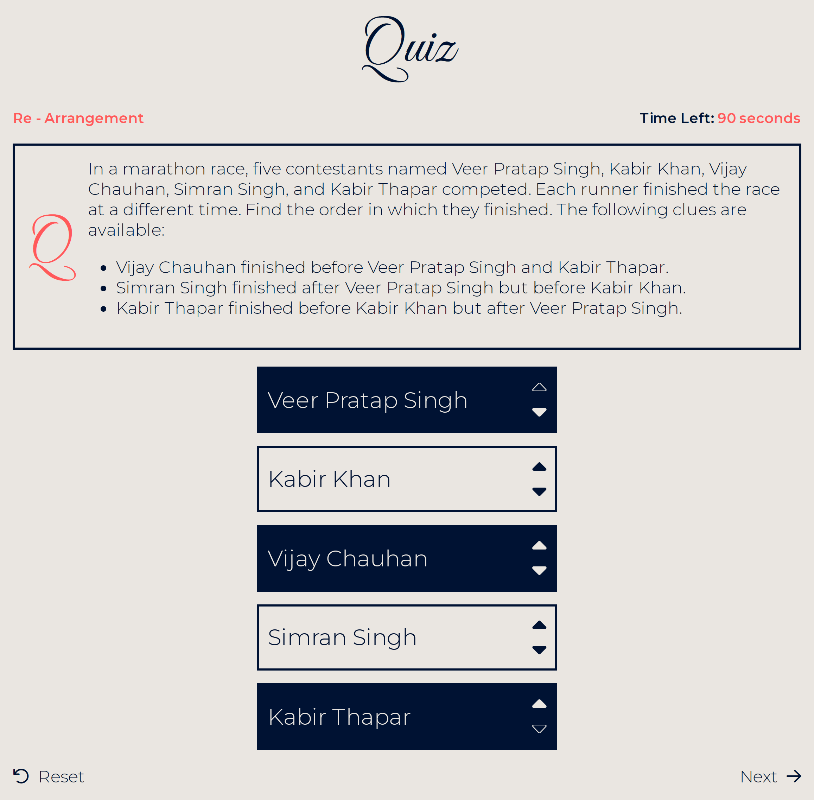
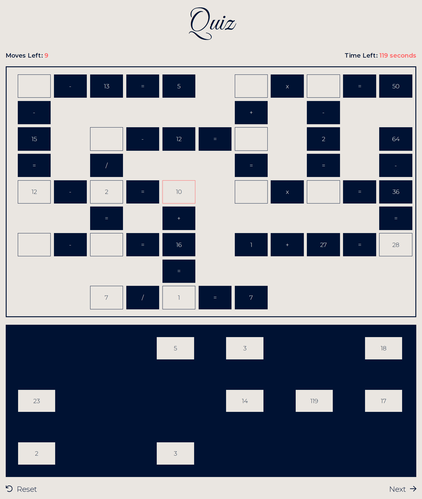
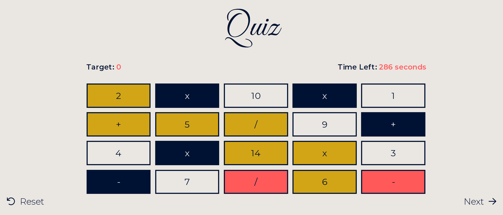

# Personal Project - Advanced Quiz

- This is a personal project undertaken to enhance and get hands-on practice.
- This project is a 10 question **quiz** wherein user completes questions to win.
- The project consists of 5 questions and 5 games. (both are logical such that anyone without any knowledge will be able to play)
- The project offers intuitive and simple user interface for the best experience.

## Table of contents

- [Overview](#overview)
  - [Features](#features)
  - [Screenshot](#screenshot)
  - [Links](#links)
- [My process](#my-process)
  - [What I learned](#what-i-learned)
  - [Continued development](#continued-development)

## Overview

### Features

1. The website follows the system theme. (light/dark theme)
2. All the questions have timer which adds a level of difficulty for the user.
3. This quiz has logical questions
    - *Single Choice* questions: Select only 1 answer to win the round.
    - *Multiple Choice* questions: Select 1 or more answers to win the round.
    - *Text Based* questions: Enter answer in the text field to win the round.
    - *Re - Arrangement* questions: Re-arrange the list of items to win the round.
4. This quiz has logical games
    - *Mole Enigma* - To win the round, identify the mole hidden behind a number using the hints provided.
    - *Number Wizardry* - Enter numbers and operators to achieve a desired result.
    - *Arithmetic Expresser* - Enter operator in - between numbers to achieve a desired result (BODMAS rule followed).
    - *Calculation Crossgrid* - Enter given numbers to complete the crossword.
    - *Arithmetic Puzzle Trek* - Connect numbers with operators to reach the target by tracing along the path.

### Screenshot

Re - Arrangement - Re-arrange the list of items to win the round.


Calculation Crossgrid - Enter given numbers to complete the crossword.


Arithmetic Puzzle Trek - Connect numbers with operators to reach the target by tracing along the path.


### Links

- Solution URL: [Repository link](https://github.com/kushagarwal11ag/quiz)
- Live Site URL: [Website link](https://kushagarwal11ag.github.io/quiz)

## My process

### What I learned

- Website theming.
- Working with complex JavaScript code.
- Code optimization and better efficiency.

Website theming is dark according to system preferences.
```css
@media (prefers-color-scheme: dark) {
	:root {
		--clr-text: #eae6e1;
		--clr-background: #001233;
		--clr-secondary: #eae6e1;
	}
}
```


Adding a timer to add a level of difficulty for the user.
```js
function countdownTimer(duration, callback) {
	interval = setInterval(() => {
		timeDisplay.innerText = `${duration} seconds`;
		duration--;
		if (duration < 0) {
			callback();
			clearInterval(interval);
		}
	}, 1000);
}
```

### Continued development

- The project could be further enhanced by adding Account Credentials (Sign-in/Sign-Up) to give the user better access to *Quiz* features.
- A leader-board could be added to log all the players which have played the game.
- Rewards and checkpoints could be added.
- Page reloads resets the question. This must be prevented because if you lose the round and look at the explanation and then reset the question, you would be able to win the round.
- Going back brings you to the previous question which should be prevented.
- JavaScript variables and functions that hold data must be privatized.